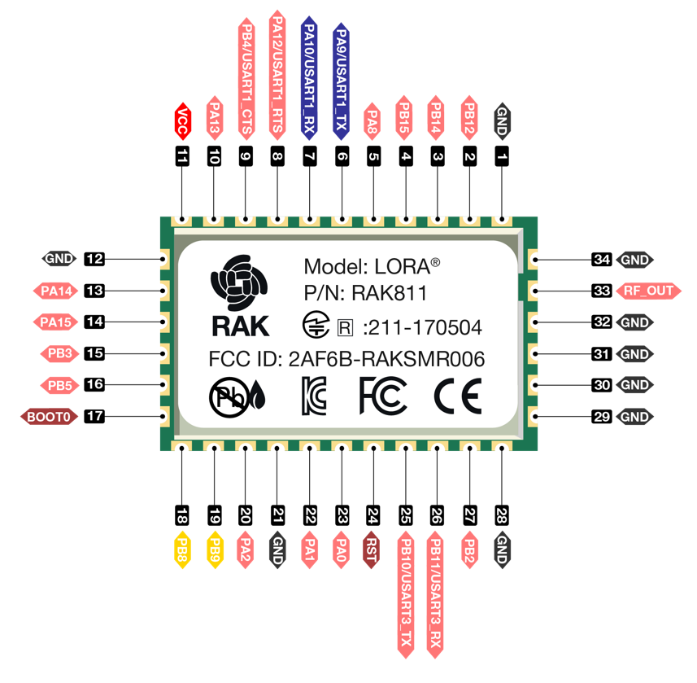

# LoRaWAN Mailbox notifier

My take on building a "mailbox notifier" device which will notify me when new mail arrives.

The mailbox has two doors. One door is used to put the mail into the mailbox, and the other one is opened to collect the mail.

## Requirements from my side when deciding on a solution

* I want a instant notification when new mail is put in the mailbox.
* I want the system to automatically remove the "new mail" flag once the mailbox has been emptied.
* The "new mail" flag should be possible to set/unset thru a downlink message.
* The device should send a "heartbeat" every XX hours (typically every 24h) so that we know that device is alive. This interval should be configurable thru a downlink message.
* The device will be battery powered, and I want the battery to last for at least two years.
* The solution should be as cheap as possible, and contain as few components as possible.

## Based on my requirements above, I decided for the following hardware

* The *brain* will be a RAK811 LoRaWAN module from *RAKWireless* will be used. This module contains a STM microcontroller which will run the custom firmware as well as the LoRaWan Chip. 
* Two reed switches with NO/NC capabilities. One for the door thru which the mail is put into the mailbox, and one door that is used to empty the mailbox. Normally, a *NO* switch should be sufficient, but I went for a NO/NC reed switch due to an issue in the RAKwireless *API* with the pull-up resistor and interrupts.
* A 1500 mAh LiFoPE4 battery which can be used to power the RAK811 board directly without any step-up or step-down voltage conversion.

## Software was built to

* On power-on, automatically join to the LoRaWAN Network.
* On timer wake up ever XX hours, send a "heartbeat" containing one byte of data, which indicates the current mail/no-mail (0x00/0x01) status.
* On external interrupt on either pin 2 or pin 3:
  * Wake from sleep.
  * Send either 0x00 or 0x01 depending on which of the door it was that triggered the interrupt.
* Receive downlink on LoRaWAN port 1 containing 1 byte to control the wake up timer (in hours). 0x01 sets the interval to 1 hour, 0x02 sets it to 2 hours and so on. If it is set to 0x00, then the device will send a uplink message every 60 seconds which is useful while debugging and testing LoRaWan transmissions.
* Go back to sleep

## Battery lifetime

When calculating the battery life time with the help of a online calculator the calculator says that the battery should last around 3540 days based on the following input:

* The finished device has a sleep current of 11 μA. During transmission the module consumes 30mA.
* In *worst case scenario*, three uplink messages per day (one heartbeat, one "new mail" and one "mail collected" uplink) will be sent.
* Each uplink message takes around 3 seconds, and to be on the safe side a 30 mA TX current consumption will be used. In reality, the tx-window is shorter than 3 seconds, since there is a 2 second RX-window in which the device only uses around 5 mA.
* The device sleeps for the remaining 86391 seconds of the 24h period.

## Conclusion

This was my first project where I developed a custom firmware for the RAK module. I was surprised on how easy it was to get started with *RUI* as RAKWireless has named their "API" environment for developing custom firmware

Running my custom firmware on the RAK module removes the need of having a extra MCU (communication thru AT commands) which would add both cost and increase complexity and current consumption. The RAK811 module is also very tiny (15x22mm) which reduces the space requirements.

NOTE: When the time of writing (year 2022), the RAK811 module is EOL and replaced newer models from RAKWireless which should be used instead.
